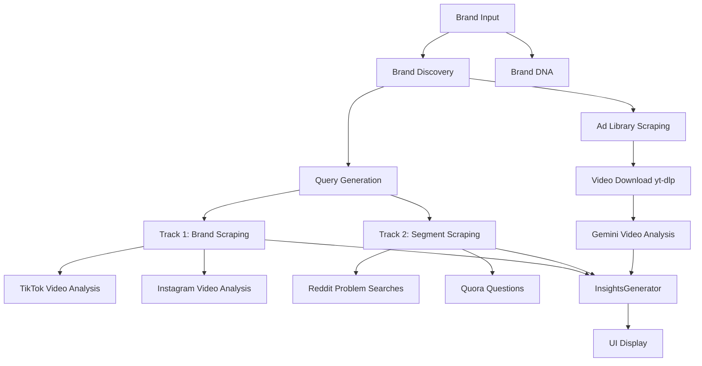

# SCRAPPER System Architecture Documentation

## Overview

Intelligent web scraper system that collects, analyzes, and generates insights from brand mentions, competitor data, and social media content across multiple platforms.

---

## System Components

### 1. Research Orchestrator
**File:** `app/services/research_orchestrator.py`

Central coordinator that runs the complete research pipeline in 7 phases:

```
Phase 1: Brand DNA + Discovery (PARALLEL)
Phase 2: Query Generation (sequential)
Phase 3: Scraping - Track 1 then Track 2 (SEQUENTIAL)
Phase 4: Ad Library Analysis
Phase 5: Competitor Analysis
Phase 6: Insights Generation
Phase 7: Content Generation
```

### 2. Scrapers

| Scraper | Platform | API Used | Rate Limiting |
|---------|----------|----------|---------------|
| **FirecrawlScraper** | Reddit, Trustpilot, News, Quora | Firecrawl API | 2 concurrent, 2s between requests |
| **ApifyScraper** | Twitter, TikTok, Instagram, Facebook, Amazon, Google | Apify Cloud | Per-actor limits |
| **SocialFreeScraper** | N/A (legacy, mostly broken) | Free APIs | N/A |
| **AdLibraryScraper** | Meta Ad Library | Browser automation | Sequential downloads |

### 3. Analyzers

| Analyzer | Purpose | API |
|----------|---------|-----|
| **AdAnalyzer** | Analyze Ad Library videos | Gemini Vision |
| **SocialMediaAnalyzer** | Analyze TikTok/Instagram videos | Gemini Vision |
| **LandingPageAnalyzer** | Analyze competitor landing pages | OpenAI/Gemini |
| **CompetitorAnalyzer** | Build competitor profiles | OpenAI/Gemini |

### 4. Generators

| Generator | Output |
|-----------|--------|
| **InsightsGenerator** | Creative dimensions, ICPs, messaging angles |
| **ScriptGenerator** | Ad scripts with scene directions |
| **ThumbnailSuggester** | Thumbnail concepts |
| **ABTestSuggester** | A/B test recommendations |

---

## Data Flow



---

## Execution Order

### Track 1 (Brand Mentions)
Runs SEQUENTIALLY with these scrapers:
1. Reddit (brand queries)
2. Trustpilot
3. General reviews
4. News/blogs
5. Competitors
6. **Twitter** (Apify)
7. **Instagram** (Apify) + Video Analysis
8. **TikTok** (Apify) + Video Analysis
9. Facebook (Apify)
10. YouTube
11. Quora
12. Medium
13. LinkedIn

### Track 2 (Segment Research)
Runs AFTER Track 1:
1. Subreddits
2. Reddit problem searches (NEW)
3. Forums
4. Deep segment search
5. **Quora questions** (NEW)
6. Twitter hashtags
7. TikTok hashtags (Apify)
8. Instagram hashtags (Apify)
9. Amazon products
10. Google Reviews

### Ad Library Phase
Runs AFTER scraping:
1. Discover ad library URL
2. Scrape brand ads
3. Download videos (yt-dlp)
4. Download images
5. Analyze videos (Gemini)
6. Scrape competitor ads
7. Aggregate patterns

---

## Rate Limiting & Safety

### Firecrawl
- Global semaphore: 2 concurrent requests
- Minimum interval: 2 seconds between requests
- 429 retry: Up to 3 retries with exponential backoff

### Video Analysis (TikTok/Instagram)
- Max 20 videos per platform
- 1 second delay between videos
- 60 second timeout for Gemini processing
- 50MB max file size

### Ad Library Videos
- Sequential processing (one at a time)
- 60 second upload timeout
- 300 second analysis timeout

### Apify
- Per-actor rate limits (handled by Apify)
- Memory limits specified per actor

---

## Query Generation

The `KeywordGeneratorService` uses LLM to generate platform-specific queries:

### Brand Queries (Track 1)
- Reddit: `"brand_name"`, `brand review`, `brand worth it`
- Twitter: `@handle`, `#brand`, `tried brand`
- TikTok: `#brandreview`, `#brandresults`
- Instagram: `#brand`, `#mybrandjourney`
- Trustpilot: `brand_name`

### Segment Queries (Track 2)
- Subreddits: Real community names (r/tressless, r/loseit)
- Reddit searches: Problem-focused queries
- Quora questions: "How do I...", "What is the best..."
- TikTok: Viral patterns (#ProblemTok, #NicheCheck)
- Twitter: Emotional language ("why is X so hard")

---

## Database Schema

```
Brand
├── id, name, website_url
├── sector, vertical, products, target_audience
├── brand_colors[], brand_values[], brand_aesthetic[]
├── tagline, tone_of_voice[], logo_url, fonts[]
└── brand_images[], social_media_urls{}, product_descriptions[]

ResearchSession
├── id, brand_id, status
├── progress_percent, current_phase
├── brand_queries{}, segment_queries{}
└── started_at, completed_at

ScrapedData
├── id, session_id, source_type, track
├── mention_type (direct_brand/segment_discussion/problem_discussion)
├── title, content, source_url
├── author, rating, likes, comments_count
├── video_analysis{}, video_file (for TikTok/Instagram)
└── raw_data{}

Insight
├── id, session_id
├── brand_summary, top_positives[], top_negatives[]
├── icps[], messaging_angles[], objections[]
├── verbatim_quotes[], pain_points[]
├── ad_creative_patterns{}, ad_library_data{}
├── competitor_profiles[], swot_analysis{}
├── scripts[], thumbnails[], ab_tests[]
└── full_report (markdown)
```

---

## Environment Variables

```env
# Required
FIRECRAWL_API_KEY=fc-...
APIFY_API_TOKEN=apify_api_...
GEMINI_API_KEY=AI...
OPENAI_API_KEY=sk-...

# Database
DATABASE_URL=sqlite+aiosqlite:///./database.db

# Optional
FIRECRAWL_BASE_URL=https://api.firecrawl.dev/v1
```

---

## Files Structure

```
backend/
├── app/
│   ├── config.py           # Settings (MAX_POSTS_PER_SOURCE=100)
│   ├── models.py           # SQLAlchemy models
│   ├── routers/
│   │   └── research.py     # API endpoints
│   ├── services/
│   │   ├── research_orchestrator.py  # Main coordinator
│   │   ├── brand_discovery.py
│   │   ├── brand_dna.py
│   │   ├── keyword_generator.py      # Query generation
│   │   ├── insights.py               # Insights generation
│   │   ├── social_media_analyzer.py  # TikTok/IG video analysis
│   │   ├── adlibrary.py             # Ad Library scraping
│   │   ├── competitors.py
│   │   ├── generators/
│   │   │   ├── scripts.py
│   │   │   ├── thumbnails.py
│   │   │   └── ab_tests.py
│   │   ├── scrapers/
│   │   │   ├── firecrawl.py
│   │   │   ├── apify.py
│   │   │   └── social_free.py
│   │   └── llm/
│   │       ├── client.py
│   │       └── prompts.py
│   └── utils/
│       └── logging.py      # Session logging & quota tracking
└── output/
    ├── social_media/       # Downloaded TikTok/IG videos
    └── adlibrary/          # Downloaded ad videos/images
```

---

## Monitoring

### Session Logging
```python
from app.utils.logging import add_session_log, get_session_stats

# Add log
add_session_log(session_id, "Message", level="info", source="scraper")

# Track API usage
track_api_call(session_id, "firecrawl", success=True)
track_rate_limit(session_id, "gemini")
track_items_scraped(session_id, count)

# Get stats
stats = get_session_stats(session_id)
# Returns: api_calls, api_errors, rate_limits, quota_warnings, total_items_scraped
```

### Logs in Console
All scrapers print detailed logs:
- `[Source] Status message`
- `[!] Error message`
- `[+] Success with counts`

---

## UI Display (Results.tsx)

| Tab | Component | Shows |
|-----|-----------|-------|
| Brand DNA | BrandDNAView | Colors, values, logo, aesthetic |
| Creative Dimensions | InsightsView | ICPs, angles, quotes, verbatim quotes |
| Ad Intelligence | AdIntelligenceView | Patterns, thumbnails grid, transcriptions |
| Generated Content | GeneratedContentView | Scripts, thumbnails, A/B tests |
| Raw Data | DataView | Filterable scraped data with video analysis |
| Full Report | ReactMarkdown | Complete markdown report |

---

## Known Limitations

1. **Amazon Scraper**: Requires paid Apify actor (subscription needed)
2. **Free Social Scrapers**: Mostly broken (Nitter dead, Instagram needs login)
3. **Ad Library**: Rate limited by Meta, may fail for some brands
4. **Video Analysis**: Limited to 20 per platform to control Gemini costs

---

## Roadmap / Planned Improvements

### Instagram Brand Feed Scraping
**Priority: HIGH**
- Scrape brand's entire Instagram profile feed (not just hashtag searches)
- Extract visual posts (images, carousels, Reels)
- Get captions/copy from each post
- Analyze visual style patterns
- Target: ~50 most recent posts

### TikTok Brand vs Niche Separation
**Priority: HIGH**
- **Brand Content (Track 1)**: Scrape brand's TikTok profile directly
- **Niche Content (Track 2)**: Search by category hashtags
- Keep these sources clearly differentiated
- Extract trending sounds used

### Copy/Text Extraction
**Priority: MEDIUM**
- Extract full captions from all posts
- Identify hashtags used
- Capture CTAs (calls to action)
- Detect offer/promo language

### Visual Data Extraction
**Priority: MEDIUM**
- Download video thumbnails/first frames
- Analyze color palette patterns
- Detect text overlays in images
- Categorize content types (UGC, professional, meme)
