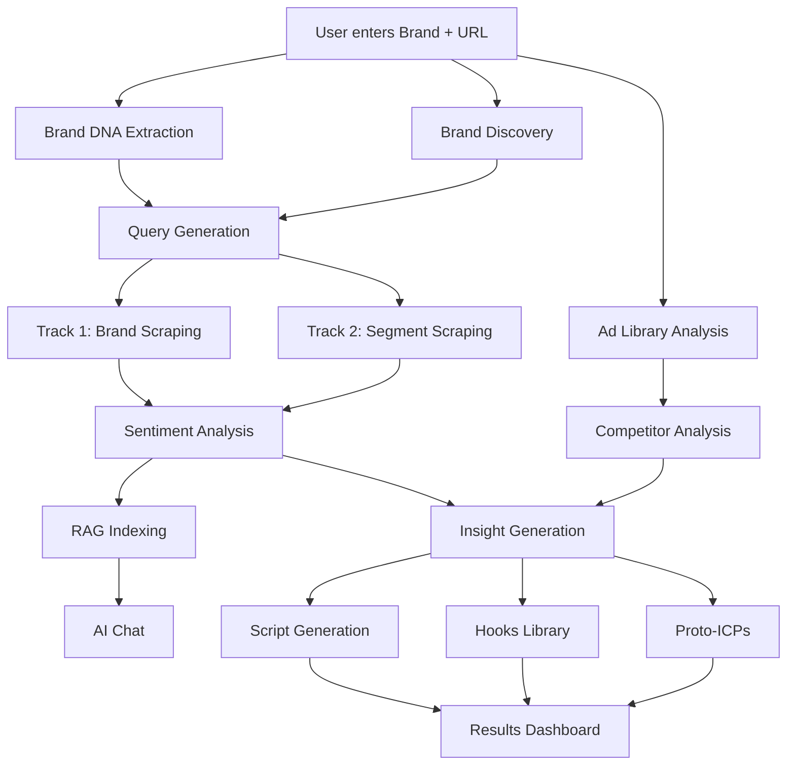

<p align="center">
  <h1 align="center">🧠 Brand Intelligence Scraper</h1>
  <p align="center">
    <strong>AI-powered competitive intelligence platform for creative teams</strong>
  </p>
  <p align="center">
    Scrape, analyze, and generate creative briefs from real customer conversations across 10+ platforms.
  </p>
  <p align="center">
    <a href="#features">Features</a> •
    <a href="#quick-start">Quick Start</a> •
    <a href="#architecture">Architecture</a> •
    <a href="#api-reference">API</a> •
    <a href="#deployment">Deployment</a>
  </p>
</p>

---

## What It Does

Brand Intelligence Scraper takes a brand name and website URL, then:

1. **Extracts Brand DNA** — Colors, fonts, tagline, values, social media presence, and visual aesthetic from the website
2. **Scrapes 10+ platforms** — Reddit, Twitter/X, TikTok, Instagram, YouTube, Amazon Reviews, Google Reviews, Trustpilot, Forums, and News
3. **Analyzes Meta Ad Library** — Downloads and analyzes the brand's active ad creatives (video + static) with frame-by-frame AI analysis
4. **Generates Creative Dimensions** — ICPs, pain points, value propositions, messaging angles, hooks, and ad scripts grounded in real customer data
5. **Provides an AI chatbot** — Ask questions about the research data using RAG-powered semantic search

The entire pipeline runs in ~15–25 minutes and produces a comprehensive report that would take a creative strategist days to compile manually.

---

## Features

### Research Pipeline

| Phase | Description | Parallelized |
|---|---|---|
| **Brand DNA** | Extract visual identity, tone, products from website | ✅ |
| **Discovery** | Identify sector, vertical, competitors via LLM | ✅ |
| **Query Generation** | Generate platform-specific search queries | — |
| **Track 1 Scraping** | Brand-specific mentions across all platforms | ✅ |
| **Track 2 Scraping** | Market segment research (forums, TikTok trends) | ✅ |
| **Ad Library** | Scrape & analyze Meta ads (50+ video, 25+ static) | ✅ (background) |
| **Competitor Analysis** | Profile competitors, build SWOT matrix | ✅ |
| **Insight Generation** | ICPs, pain points, hooks, scripts, A/B tests | — |
| **RAG Indexing** | Index all data for semantic chat search | — |

### Output Modules

- **Creative Dimensions** — ICPs, pain points, value props, messaging angles
- **Hooks Library** — 30+ categorized ad hooks with strength scores
- **Ad Scripts** — AI-generated scripts in UGC, testimonial, educational formats
- **Competitor Intelligence** — Profiles, SWOT analysis, competitive matrix
- **TikTok Trends** — Trending sounds, hashtags, content patterns
- **Instagram Brand Presence** — Voice analysis, visual aesthetic, content pillars
- **Proto-ICPs** — Data-driven customer segmentation based on triggers × blockers
- **Sentiment Analysis** — RoBERTa-based sentiment with per-source breakdown
- **AI Chat** — Ask questions about research data with source attribution
- **Idea Bank** — Save, tag, and organize creative ideas across sessions

### Frontend

- Real-time research progress tracking with phase-level detail
- Interactive results dashboard with tabbed views
- Ad creative viewer with video playback and analysis overlay
- Sentiment visualization by source
- Export to Markdown
- Share via ngrok tunnel

---

## Quick Start

### Prerequisites

| Requirement | Version |
|---|---|
| Python | 3.10+ |
| Node.js | 18+ |
| npm | 9+ |

### API Keys Required

| Service | Purpose | Get Key |
|---|---|---|
| **OpenAI** _or_ **Google Gemini** | LLM analysis (GPT-4o / Gemini 2.5 Flash) | [OpenAI](https://platform.openai.com/api-keys) / [Gemini](https://aistudio.google.com/apikey) |
| **Firecrawl** | Web scraping & search | [firecrawl.dev](https://www.firecrawl.dev/app/api-keys) |
| **Apify** | Social media scraping (TikTok, Twitter, Reddit) | [apify.com](https://console.apify.com/account/integrations) |

### Installation

```bash
# Clone the repository
git clone https://github.com/YOUR_USERNAME/brand-intelligence-scraper.git
cd brand-intelligence-scraper

# ── Backend ────────────────────────────────────────
cd backend

# Create virtual environment
python -m venv venv

# Activate (Windows)
.\venv\Scripts\activate
# Activate (macOS/Linux)
source venv/bin/activate

# Install dependencies
pip install -r requirements.txt

# Install Playwright browsers (for Ad Library scraping)
playwright install chromium

# Configure environment
cp .env.example .env
# Edit .env with your API keys

# ── Frontend ───────────────────────────────────────
cd ../frontend
npm install
```

### Running Locally

**Option A — Two terminals:**

```bash
# Terminal 1: Backend
cd backend
.\venv\Scripts\activate  # or source venv/bin/activate
uvicorn app.main:app --reload --host 0.0.0.0 --port 8000

# Terminal 2: Frontend
cd frontend
npm run dev
```

**Option B — Windows quick start:**

```bash
# From project root (adjust paths in .bat file first)
start_servers.bat
```

Then open **http://localhost:5173** in your browser.

### Running with Docker

```bash
docker-compose up --build
```

Services:
- Frontend: http://localhost:3000
- Backend API: http://localhost:8000
- API Docs: http://localhost:8000/docs
- AnythingLLM: http://localhost:3001

---

## Architecture

```
brand-intelligence-scraper/
├── backend/
│   ├── app/
│   │   ├── main.py              # FastAPI entry point
│   │   ├── config.py            # Pydantic settings from .env
│   │   ├── database.py          # Async SQLAlchemy engine
│   │   ├── models.py            # ORM models (Brand, Session, Data, Insight)
│   │   ├── schemas.py           # Pydantic request/response schemas
│   │   ├── routers/
│   │   │   ├── brands.py        # CRUD for brands
│   │   │   ├── research.py      # Research pipeline endpoints
│   │   │   ├── chat.py          # AI chatbot + RAG endpoints
│   │   │   └── idea_bank.py     # Idea Bank CRUD
│   │   ├── services/
│   │   │   ├── research_orchestrator.py  # Pipeline coordinator (phases 1-6)
│   │   │   ├── brand_dna.py              # Website → visual identity extraction
│   │   │   ├── brand_discovery.py        # LLM-based brand analysis
│   │   │   ├── keyword_generator.py      # Search query generation
│   │   │   ├── insights.py               # Creative Dimensions generator
│   │   │   ├── chatbot.py                # AI chat with research data
│   │   │   ├── sentiment.py              # RoBERTa sentiment analysis
│   │   │   ├── scrapers/
│   │   │   │   ├── firecrawl.py          # Web scraping via Firecrawl API
│   │   │   │   ├── apify.py              # Social scraping via Apify
│   │   │   │   └── social_free.py        # Free scrapers (instaloader, ntscraper)
│   │   │   ├── adlibrary/
│   │   │   │   ├── scraper.py            # Meta Ad Library scraping
│   │   │   │   ├── analyzer.py           # Gemini Vision ad analysis
│   │   │   │   └── taxonomies.py         # Ad creative classification
│   │   │   ├── generators/
│   │   │   │   ├── scripts.py            # Ad script generation
│   │   │   │   ├── thumbnails.py         # Thumbnail concept generation
│   │   │   │   └── ab_tests.py           # A/B test suggestion generation
│   │   │   ├── llm/
│   │   │   │   ├── client.py             # OpenAI/Gemini unified client
│   │   │   │   └── prompts.py            # Prompt templates
│   │   │   └── rag/
│   │   │       ├── vector_store.py       # ChromaDB vector store
│   │   │       └── embeddings.py         # Embedding generation
│   │   └── utils/
│   │       ├── session_logging.py        # Real-time log streaming
│   │       ├── api_metrics.py            # API usage tracking
│   │       └── api_quota_tracker.py      # Pre-flight quota checks
│   ├── requirements.txt
│   ├── Dockerfile
│   └── .env.example
├── frontend/
│   ├── src/
│   │   ├── App.tsx                       # React Router + Error Boundary
│   │   ├── api/client.ts                 # Axios API client + TypeScript types
│   │   ├── pages/
│   │   │   ├── Dashboard.tsx             # Brand list + new research
│   │   │   ├── Research.tsx              # Live progress tracking
│   │   │   ├── Results.tsx               # Results dashboard (tabbed)
│   │   │   └── IdeaBank.tsx              # Saved ideas management
│   │   └── components/
│   │       ├── InsightsView.tsx           # ICPs, pain points, hooks
│   │       ├── AdIntelligenceView.tsx     # Ad Library browser
│   │       ├── BrandDNAView.tsx           # Visual identity display
│   │       ├── SentimentView.tsx          # Sentiment charts
│   │       ├── TikTokTrendsView.tsx       # TikTok analysis
│   │       ├── HooksLibraryView.tsx       # Hook catalog
│   │       ├── ChatPanel.tsx              # AI chat interface
│   │       └── ...
│   ├── package.json
│   ├── Dockerfile
│   └── vite.config.ts
├── docker-compose.yml
├── CONTRIBUTING.md
├── SECURITY.md
├── CHANGELOG.md
├── LICENSE
└── docs/                                  # Internal technical documentation
```

### Data Flow



### Tech Stack

| Layer | Technology |
|---|---|
| **API Framework** | FastAPI 0.115 (async) |
| **Database** | SQLite + aiosqlite (async ORM via SQLAlchemy 2.0) |
| **LLM** | OpenAI GPT-4o / Google Gemini 2.5 Flash (configurable) |
| **Web Scraping** | Firecrawl API |
| **Social Scraping** | Apify (TikTok, Twitter, Reddit, Instagram, Reviews) |
| **Video Analysis** | Gemini Vision (frame-by-frame ad analysis) |
| **Sentiment** | RoBERTa (`cardiffnlp/twitter-roberta-base-sentiment-latest`) |
| **Vector Store** | ChromaDB (local, for RAG chat) |
| **Frontend** | React 19 + TypeScript + Vite + TailwindCSS |
| **State Management** | TanStack React Query |
| **Deployment** | Docker Compose / ngrok (for sharing) |

---

## API Reference

Full interactive documentation is available at `http://localhost:8000/docs` (Swagger UI) when the backend is running.

### Core Endpoints

#### Brands

| Method | Endpoint | Description |
|---|---|---|
| `POST` | `/api/brands/` | Create a brand |
| `GET` | `/api/brands/` | List all brands |
| `GET` | `/api/brands/{id}` | Get brand details |
| `DELETE` | `/api/brands/{id}` | Delete a brand |

#### Research

| Method | Endpoint | Description |
|---|---|---|
| `POST` | `/api/research/start` | Start a new research session |
| `GET` | `/api/research/session/{id}` | Get session status |
| `GET` | `/api/research/session/{id}/progress` | Get detailed progress (live) |
| `GET` | `/api/research/session/{id}/insights` | Get generated insights |
| `GET` | `/api/research/session/{id}/data` | Get raw scraped data |
| `GET` | `/api/research/session/{id}/sentiment` | Get sentiment analysis |
| `GET` | `/api/research/session/{id}/full` | Get complete results |
| `GET` | `/api/research/session/{id}/logs` | Get real-time logs |
| `GET` | `/api/research/session/{id}/export` | Export as Markdown |
| `POST` | `/api/research/session/{id}/generate-scripts` | Generate more ad scripts |
| `POST` | `/api/research/reprocess/{id}` | Re-run insight generation |
| `POST` | `/api/research/incremental/{id}` | Add missing sources |
| `POST` | `/api/research/scrape-ads/{id}` | Run Ad Library scraping |
| `GET` | `/api/research/sessions` | List all sessions |
| `GET` | `/api/research/metrics` | API usage metrics |
| `GET` | `/api/research/health` | System health check |
| `POST` | `/api/research/cancel/{id}` | Cancel stuck session |
| `POST` | `/api/research/cancel-all-stuck` | Cancel all stuck sessions |

#### Chat

| Method | Endpoint | Description |
|---|---|---|
| `POST` | `/api/chat` | Send message to AI assistant |
| `POST` | `/api/chat/generate-script` | Generate ad script via chat |
| `POST` | `/api/chat/find-verbatims` | Find customer quotes |
| `GET` | `/api/chat/suggestions` | Get suggested questions |
| `POST` | `/api/chat/clear` | Clear chat history |
| `POST` | `/api/chat/rag` | Chat with AnythingLLM RAG |
| `GET` | `/api/chat/rag/workspaces` | List RAG workspaces |

#### Idea Bank

| Method | Endpoint | Description |
|---|---|---|
| `POST` | `/api/ideas/` | Save a creative idea |
| `GET` | `/api/ideas/` | List ideas (with filters) |
| `GET` | `/api/ideas/{id}` | Get specific idea |
| `PUT` | `/api/ideas/{id}` | Update idea |
| `DELETE` | `/api/ideas/{id}` | Delete idea |
| `POST` | `/api/ideas/{id}/favorite` | Toggle favorite |
| `GET` | `/api/ideas/stats/summary` | Idea Bank statistics |

#### Intake Engine

| Method | Endpoint | Description |
|---|---|---|
| `POST` | `/api/research/classify-snippets/{id}` | Classify scraped data |
| `GET` | `/api/research/proto-icps/{id}` | Get Proto-ICP clusters |
| `GET` | `/api/research/intake-report/{id}` | Full intake report |

---

## Configuration

### Environment Variables

| Variable | Required | Default | Description |
|---|---|---|---|
| `LLM_PROVIDER` | No | `openai` | LLM provider (`openai` or `gemini`) |
| `OPENAI_API_KEY` | If OpenAI | — | OpenAI API key |
| `GEMINI_API_KEY` | If Gemini | — | Google Gemini API key |
| `FIRECRAWL_API_KEY` | Yes | — | Firecrawl web scraping API key |
| `APIFY_API_TOKEN` | Yes | — | Apify social scraping API token |
| `DATABASE_URL` | No | `sqlite+aiosqlite:///./database.db` | Database connection URL |
| `MAX_POSTS_PER_SOURCE` | No | `100` | Max items per scraper |
| `MAX_REVIEWS_PER_SOURCE` | No | `50` | Max reviews per source |
| `SCRAPE_TIMEOUT` | No | `20` | Scraper timeout (seconds) |
| `AD_LIBRARY_MAX_ADS` | No | `200` | Ads to scrape from Ad Library |
| `AD_LIBRARY_MAX_BRAND_VIDEOS` | No | `30` | Brand video ads to analyze |
| `AD_LIBRARY_MAX_COMPETITORS` | No | `3` | Competitors to analyze |
| `ANYTHINGLLM_API_KEY` | No | — | AnythingLLM RAG chat key |
| `INSTAGRAM_USERNAME` | No | — | Instagram account for scraping |
| `INSTAGRAM_PASSWORD` | No | — | Instagram password |
| `DEBUG` | No | `True` | Enable debug logging |

### Cost Considerations

Typical costs per research session (single brand):

| Service | Estimated Cost | Notes |
|---|---|---|
| Firecrawl | ~$0.30–0.50 | ~15 search + scrape calls |
| Apify | ~$0.50–2.00 | TikTok, Twitter, Reddit, Reviews |
| OpenAI (GPT-4o) | ~$0.50–1.50 | Insights, scripts, queries |
| Gemini Vision | ~$0.10–0.30 | Video ad analysis (pay per frame) |
| **Total** | **~$1.40–4.30** | Per brand research session |

> **Tip:** Set `APIFY_ENABLE_GOOGLE_PLACES=False` (default) to avoid expensive Google Places scraping (~$0.05/place).

---

## Deployment

### Sharing via ngrok

```bash
# Build frontend
cd frontend && npm run build && cd ..

# Start backend (serves frontend from dist/)
cd backend
uvicorn app.main:app --host 0.0.0.0 --port 8000

# In another terminal
ngrok http 8000
```

The backend automatically serves the built frontend SPA at all non-API routes.

### Docker Compose (Production)

```bash
docker-compose up -d --build
```

This starts three services:
- **Backend** (port 8000) — API + SPA hosting
- **Frontend** (port 3000) — Nginx-served build
- **AnythingLLM** (port 3001) — Optional RAG chat engine

---

## Development

### Code Style

- **Backend:** Python 3.10+, type hints, async/await throughout
- **Frontend:** TypeScript, React functional components, TanStack Query

### Key Design Decisions

1. **Dual-track scraping** — Track 1 (brand mentions) and Track 2 (market segment) run separately to deliver different insight types
2. **Aggressive parallelization** — Brand DNA, discovery, and Ad Library run concurrently in Phase 1
3. **Graceful degradation** — Every scraper is wrapped in try/except; partial data is always saved
4. **Pre-flight quota checks** — API quotas are verified before starting expensive pipelines
5. **Deduplication** — URL + content hash dedup before database insertion
6. **Sentiment-before-save** — RoBERTa sentiment is computed before DB commit for atomicity

---

## License

MIT — See [LICENSE](LICENSE) for details.

---

## Acknowledgments

Built with [FastAPI](https://fastapi.tiangolo.com/), [React](https://react.dev/), [Firecrawl](https://www.firecrawl.dev/), [Apify](https://apify.com/), [ChromaDB](https://www.trychroma.com/), and [TailwindCSS](https://tailwindcss.com/).
