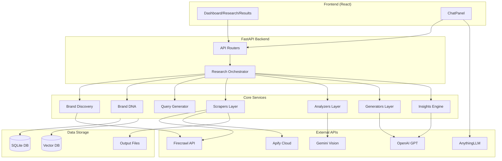
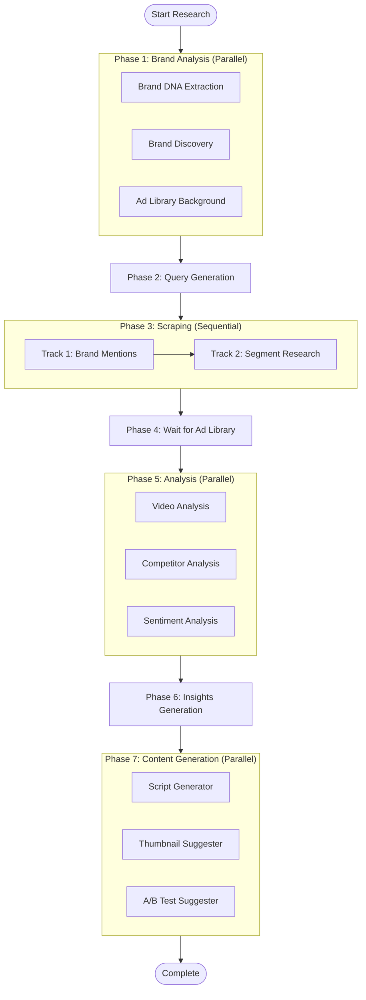
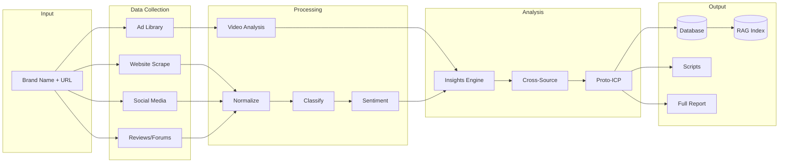
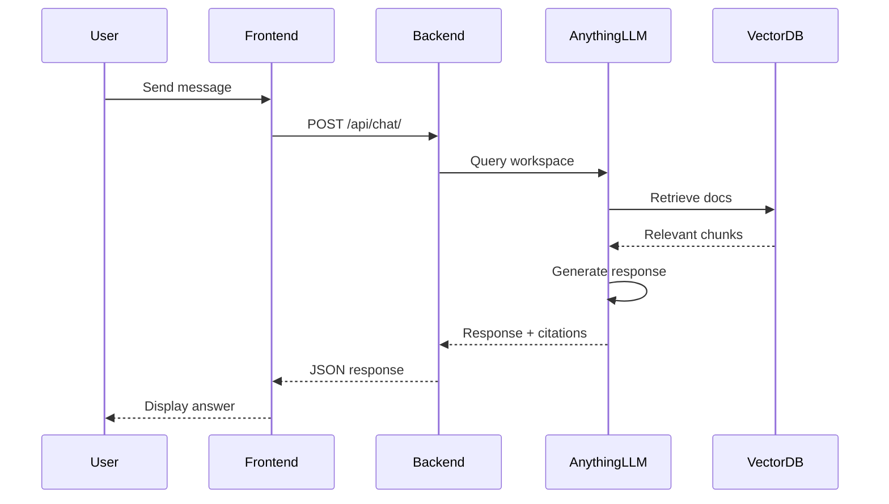
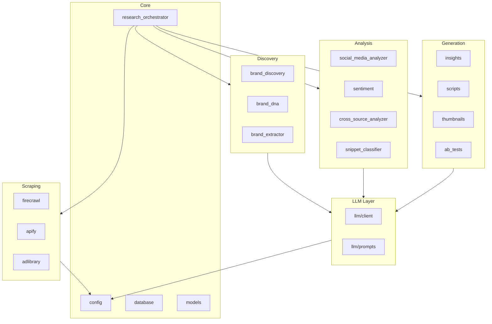
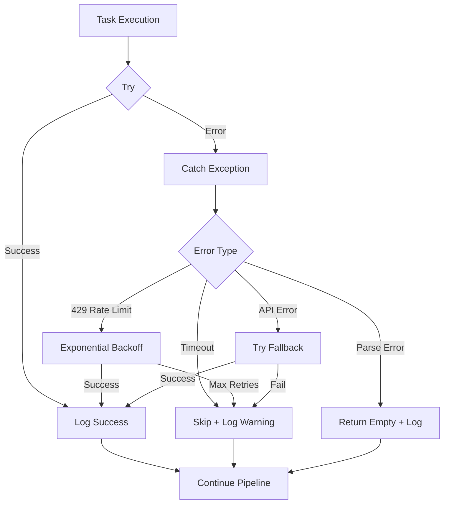

# System Architecture

> High-level architecture of the Brand Intelligence Scraper system with data flow diagrams and component relationships.

---

## System Overview

The Brand Intelligence Scraper is a multi-source data collection and analysis platform that:

1. **Discovers** brand identity from websites
2. **Scrapes** mentions and reviews from 15+ platforms
3. **Analyzes** content with AI (text + video)
4. **Generates** creative assets (scripts, thumbnails, insights)
5. **Provides** RAG-powered chat interface

---

## High-Level Architecture

---

## Research Pipeline Flow

The main research pipeline runs in 7 phases:

---

## Data Flow Diagram

---

## Scraping Architecture

```mermaid
flowchart TB
    subgraph Track1["Track 1: Brand Mentions"]
        R1[Reddit Brand]
        TP[Trustpilot]
        News[News/Blogs]
        TW[Twitter/X]
        IG[Instagram]
        TT[TikTok]
        FB[Facebook]
        YT[YouTube]
        QR[Quora]
    end
    
    subgraph Track2["Track 2: Segment Research"]
        SUB[Subreddits]
        PROB[Problem Searches]
        FOR[Forums]
        QQ[Quora Questions]
        HASH[Hashtag Searches]
        AMZ[Amazon Reviews]
        GOOG[Google Reviews]
    end
    
    subgraph Scrapers["Scraper Layer"]
        FC[Firecrawl Scraper]
        AP[Apify Scraper]
        SF[Social Free - Legacy]
    end
    
    R1 --> FC
    TP --> FC
    News --> FC
    QR --> FC
    SUB --> FC
    PROB --> FC
    FOR --> FC
    QQ --> FC
    
    TW --> AP
    IG --> AP
    TT --> AP
    FB --> AP
    AMZ --> AP
    GOOG --> AP
    HASH --> AP
```

---

## RAG Chat Architecture

---

## Sources of Truth

### Canonical Storage

| Data Type | Storage | Location |
|-----------|---------|----------|
| Raw scraped data | SQLite | `scraped_data` table |
| Cleaned/enriched data | SQLite | `scraped_data.raw_data` JSON |
| Brand metadata | SQLite | `brands` table |
| Session state | SQLite | `research_sessions` table |
| Insights/ICPs | SQLite | `insights` table |
| Video files | Filesystem | `output/adlibrary/`, `output/social_media/` |
| Embeddings | ChromaDB | `vector_db/` |
| RAG documents | AnythingLLM | Per-workspace storage |
| Session logs | Filesystem | `logs/research_session_*.jsonl` |

### Primary Key System

| Entity | Primary Key | Format | Example |
|--------|-------------|--------|---------|
| Brand | `brand_id` | Auto-increment | `42` |
| Session | `session_id` | Auto-increment | `77` |
| Scraped Item | `id` | Auto-increment | `12345` |
| Insight | `id` | ForeignKey(session_id) | `77` |
| Video file | URL hash | `{brand}/video_{idx}.mp4` | `goodfood/video_001.mp4` |

### Linking Keys

| Relationship | Key | Notes |
|--------------|-----|-------|
| Brand → Sessions | `brand_id` | One-to-many |
| Session → Data | `session_id` | One-to-many |
| Session → Insights | `session_id` | One-to-one |
| Data → Source | `source_type` | Enum (reddit, twitter, etc.) |
| Data → Track | `track` | 1 = Brand, 2 = Segment |

---

## Component Dependencies

---

## Error Handling Flow

---

## Technology Stack Summary

| Layer | Technology | Purpose |
|-------|------------|---------|
| Frontend | React + TypeScript | UI |
| Styling | Tailwind CSS | Design |
| API | FastAPI | Backend |
| ORM | SQLAlchemy (async) | Database |
| Database | SQLite | Storage |
| Vector DB | ChromaDB | Embeddings |
| LLM | OpenAI GPT-4o | Text generation |
| Vision | Gemini 2.0 Flash | Video analysis |
| Web Scraping | Firecrawl | General web |
| Social Scraping | Apify | Social platforms |
| Video Download | yt-dlp | Media download |
| Browser Automation | Playwright | Ad Library |
| RAG | AnythingLLM | Chat + retrieval |
