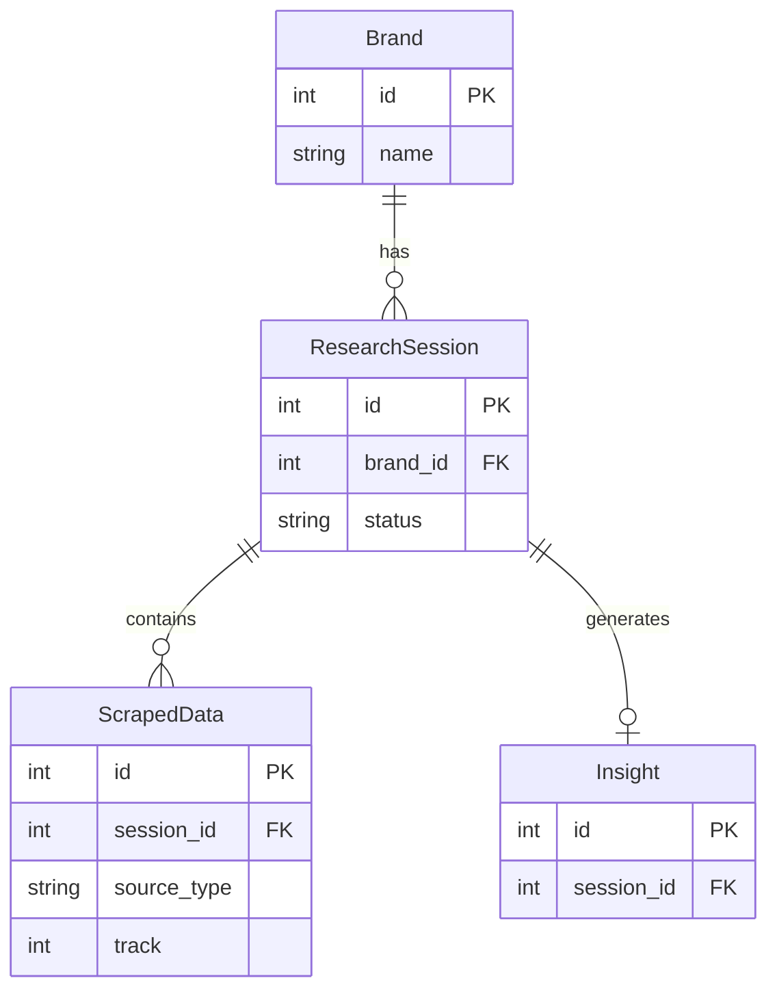

# Data Lineage

> How data flows through the system, from raw scraped content to final outputs.

---

## Overview

```mermaid
flowchart LR
    subgraph Stage1["1. Collection"]
        Web[Website Scrape]
        Social[Social APIs]
        Ads[Ad Library]
    end
    
    subgraph Stage2["2. Storage"]
        RawDB[(scraped_data)]
    end
    
    subgraph Stage3["3. Processing"]
        Proc[Processors]
        Class[Classifiers]
        Sent[Sentiment]
    end
    
    subgraph Stage4["4. Analysis"]
        Insights[Insights Engine]
        Cross[Cross-Source]
    end
    
    subgraph Stage5["5. Generation"]
        Scripts[Script Gen]
        Reports[Full Report]
    end
    
    subgraph Stage6["6. Indexing"]
        KB[Knowledge Base]
        RAG[(Vector DB)]
    end
    
    Stage1 --> Stage2
    Stage2 --> Stage3
    Stage3 --> Stage4
    Stage4 --> Stage5
    Stage5 --> Stage6
```



---

## Stage 1: Collection

### Website → Brand Discovery
```
Input:  brand.website_url
Process: firecrawl.scrape()
Output:  brand.description, sector, vertical, products, target_audience
```

### Website → Brand DNA
```
Input:  brand.website_url
Process: Firecrawl + Gemini Vision
Output:  brand.brand_colors, tagline, values, aesthetic, tone_of_voice
```

### Social Platforms → ScrapedData
```
Input:  generated_queries (brand_queries, segment_queries)
Process: Firecrawl/Apify scraping
Output:  scraped_data records (content, metrics, raw_data)
```

### Ad Library → ScrapedData + Files
```
Input:  brand.social_media_urls.facebook
Process: Playwright search + yt-dlp download + Gemini analysis
Output:  scraped_data (source_type=adlibrary) + video files
```

---

## Stage 2: Raw Storage

### ScrapedData Table
All scraped content written to single table with:
- `source_type`: Platform identifier
- `track`: 1 (brand) or 2 (segment)
- `raw_data`: Original API response preserved

### File Storage
```
output/
├── adlibrary/{brand_name}/
│   ├── video_001.mp4
│   ├── video_002.mp4
│   └── image_001.jpg
└── social_media/
    ├── tiktok/{video_id}.mp4
    └── instagram/{video_id}.mp4
```

---

## Stage 3: Processing

### Processor Pipeline
```
raw scraped_data → BaseProcessor.process() → enriched scraped_data
```

Each processor adds:
- `mention_type`: Classification
- `sentiment`: Positive/negative/neutral
- `sentiment_score`: -1.0 to 1.0
- `relevance_score`: 0.0 to 1.0
- `detected_topics`: Topic tags

### Processor Types by Source

| Source | Processor | Special Fields |
|--------|-----------|----------------|
| reddit | DiscussionProcessor | detected_topics |
| twitter | SocialProcessor | language_cues |
| tiktok | VideoProcessor | video_analysis |
| instagram | VideoProcessor | video_analysis |
| trustpilot | ReviewProcessor | rating |
| adlibrary | AdLibraryProcessor | ad patterns |

---

## Stage 4: Analysis

### Cross-Source Analyzer
```
Input:  All scraped_data for session
Process: Pattern detection across sources
Output:  insights.cross_source_insights
```

### Insights Engine
```
Input:  All processed scraped_data
Process: LLM synthesis with prompts
Output:  insights.* (ICPs, pain_points, messaging_angles, etc.)
```

### Competitor Analyzer
```
Input:  Competitor scraped_data + ad_library_data
Process: Compare pricing, features, positioning
Output:  insights.competitor_profiles, competitive_matrix, swot_analysis
```

---

## Stage 5: Generation

### Script Generator
```
Input:  insights (ICPs, pain_points, hooks, verbatim_quotes)
Process: LLM with script prompts
Output:  insights.generated_scripts
```

### Thumbnail Suggester
```
Input:  insights + brand_dna
Process: LLM with thumbnail prompts
Output:  insights.thumbnail_suggestions
```

### Report Generator
```
Input:  All insights fields
Process: Markdown template + LLM
Output:  insights.full_report
```

---

## Stage 6: Indexing

### Knowledge Base Export
```
Input:  brand, scraped_data, insights
Process: kb_exporter.export_session()
Output:  knowledge_base/{brand_name}/*.md files
```

### RAG Indexing
```
Input:  knowledge_base files
Process: Chunking → Embedding → ChromaDB
Output:  vector_db/ collections
```

### AnythingLLM Sync
```
Input:  knowledge_base files
Process: anythingllm.sync_brand_to_workspace()
Output:  Per-brand workspace in AnythingLLM
```

---

## Transformation Summary

| Dataset | Produced By | Consumed By |
|---------|-------------|-------------|
| Brand metadata | brand_discovery.py | All phases |
| Brand DNA | brand_dna.py | Generators, frontend |
| Generated queries | keyword_generator.py | Scrapers |
| Raw scraped content | Firecrawl, Apify | Processors |
| Processed content | Processors | Insights engine |
| Video analysis | Gemini Vision | Insights, scripts |
| ICPs | insights.py | Scripts, reports |
| Ad patterns | ad_analyzer.py | Scripts, reports |
| Generated scripts | scripts.py | Frontend, RAG |
| Full report | report generator | Frontend, RAG |
| Knowledge base | kb_exporter.py | RAG, AnythingLLM |
| Embeddings | embeddings.py | Vector search |

---

## ID Relationships


