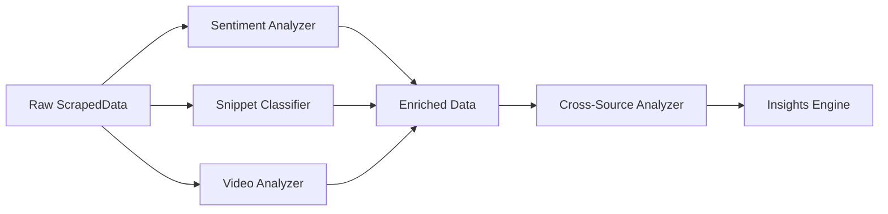

# Analyzers Module

> Documentation for content analysis services: video, sentiment, cross-source, and classification.

---

## Overview

Analyzers transform raw scraped data into enriched, classified content ready for insight generation.



---

## SocialMediaAnalyzer

**File:** `services/social_media_analyzer.py`
**Purpose:** Download and analyze TikTok/Instagram videos with Gemini Vision.

### Key Methods

| Method | Purpose | Returns |
|--------|---------|---------|
| `download_video(url, platform, id)` | Download via yt-dlp | `str` (file path) |
| `analyze_video(path, context)` | Analyze with Gemini | `Dict` |
| `analyze_social_content(data, platform, max)` | Batch process | `List[Dict]` |
| `aggregate_social_insights(data)` | Summarize findings | `Dict` |

### Configuration

```python
MAX_VIDEOS_PER_PLATFORM = 20
MAX_FILE_SIZE_MB = 50
DOWNLOAD_TIMEOUT = 60  # seconds
ANALYSIS_TIMEOUT = 60  # seconds
DELAY_BETWEEN_VIDEOS = 1  # second
```

### Video Analysis Output

```json
{
  "transcription": "Full spoken text from video",
  "hook": "First 3 seconds content",
  "hook_type": "question|statement|visual|shock",
  "hook_strength_1to5": 4,
  "content_type": "tutorial|review|trend|ugc|ad",
  "pacing": "slow|medium|fast",
  "pain_points_mentioned": ["can't find time", "too expensive"],
  "quotable_phrases": ["this changed everything"],
  "customer_language": "Verbatim expressions used"
}
```

---

## SocialVideoAnalyzer

**File:** `services/social_video_analyzer.py`
**Purpose:** Coordinate video downloads and analysis across platforms.

### Methods

| Method | Purpose |
|--------|---------|
| `process_tiktok_videos(data)` | TikTok batch processing |
| `process_instagram_videos(data)` | Instagram batch processing |
| `process_adlibrary_videos(data)` | Ad Library video processing |

---

## Sentiment Analyzer

**File:** `services/sentiment.py`
**Purpose:** Classify content sentiment as positive/negative/neutral.

### Methods

| Method | Purpose | Returns |
|--------|---------|---------|
| `classify_sentiment(text)` | Single text | `str, float` |
| `get_sentiment_analyzer()` | Get singleton | `SentimentAnalyzer` |

### Output

```python
sentiment = "positive"  # or "negative", "neutral"
sentiment_score = 0.72  # -1.0 to 1.0
```

### Implementation

- Uses keyword-based classification
- Fallback to LLM for ambiguous cases
- Considers context (reviews get different treatment than discussions)

---

## SnippetClassifier

**File:** `services/snippet_classifier.py`
**Purpose:** Classify scraped content by type and relevance.

### Classification Types

| Type | Description |
|------|-------------|
| `direct_brand` | Explicit brand mention |
| `segment_discussion` | Industry discussion |
| `competitor_mention` | Competitor comparison |
| `problem_discussion` | Pain point discussion |

### Intake Engine Fields

```python
# Primary Trigger - "Why they start searching"
primary_trigger: str  # "busy lifestyle", "health scare"

# Blocker Type
blocker_type: str  # "friction", "objection", "none"

# Desired Outcome Level
desired_outcome_level: str  # "functional", "emotional", "identity"

# Proof Type Trusted
proof_type_trusted: str  # "reviews_ugc", "vet_science", "price_math"
```

---

## CrossSourceAnalyzer

**File:** `services/cross_source_analyzer.py`
**Purpose:** Detect patterns across multiple data sources.

### Methods

| Method | Purpose | Returns |
|--------|---------|---------|
| `analyze_patterns(data)` | Find cross-source patterns | `Dict` |
| `identify_themes(data)` | Extract common themes | `List` |
| `find_contradictions(data)` | Spot conflicting info | `List` |

### Output

```json
{
  "common_themes": ["convenience", "price concerns"],
  "source_agreement": {
    "reddit": ["reddit", "trustpilot"],
    "twitter": ["instagram", "tiktok"]
  },
  "contradictions": [
    {"topic": "quality", "sources": ["reddit: positive", "trustpilot: negative"]}
  ]
}
```

---

## YouTubeAnalyzer

**File:** `services/youtube_analyzer.py`
**Purpose:** Analyze YouTube video content and comments.

### Methods

| Method | Purpose |
|--------|---------|
| `analyze_video(video_url)` | Analyze single video |
| `analyze_comments(video_id)` | Analyze comment sentiment |
| `extract_insights(data)` | Extract key insights |

---

## TwitterAnalyzer

**File:** `services/twitter_analyzer.py`
**Purpose:** Analyze Twitter/X content patterns.

### Methods

| Method | Purpose |
|--------|---------|
| `analyze_tweets(data)` | Batch tweet analysis |
| `extract_sentiment(tweets)` | Aggregate sentiment |
| `identify_influencers(data)` | Find key voices |

---

## RedditAnalyzer

**File:** `services/reddit_analyzer.py`
**Purpose:** Deep analysis of Reddit discussions.

### Methods

| Method | Purpose |
|--------|---------|
| `analyze_thread(data)` | Analyze post + comments |
| `extract_pain_points(data)` | Find pain points |
| `identify_solutions(data)` | Find recommended solutions |

---

## ReviewAnalyzer

**File:** `services/review_analyzer.py`
**Purpose:** Analyze review content from Trustpilot, G2, etc.

### Methods

| Method | Purpose |
|--------|---------|
| `analyze_reviews(data)` | Batch review analysis |
| `extract_themes(data)` | Common themes |
| `calculate_nps(data)` | Net Promoter Score estimate |

---

## Usage Example

```python
from app.services.sentiment import classify_sentiment
from app.services.snippet_classifier import SnippetClassifier
from app.services.social_media_analyzer import SocialMediaAnalyzer

# Sentiment
sentiment, score = classify_sentiment("This product is amazing!")
# sentiment = "positive", score = 0.85

# Classification
classifier = SnippetClassifier()
result = await classifier.classify(scraped_item)
# result = {"mention_type": "direct_brand", "primary_trigger": "..."}

# Video analysis
analyzer = SocialMediaAnalyzer()
videos = await analyzer.analyze_social_content(
    tiktok_data, 
    platform="tiktok", 
    max_videos=20
)
```

---

## Error Handling

All analyzers follow this pattern:

```python
try:
    result = await self.analyze(data)
except Exception as e:
    logger.error(f"Analysis failed: {e}")
    result = self._default_result()  # Return safe defaults
```
