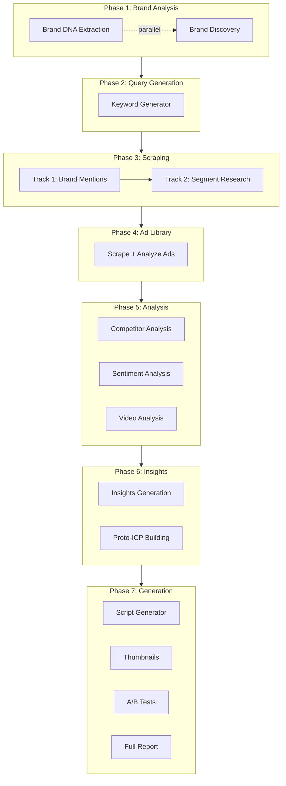

# Research Orchestrator Module

> The central coordinator that runs the complete research pipeline.

---

## Overview

**File:** `backend/app/services/research_orchestrator.py`
**Lines:** 3,489
**Purpose:** Orchestrates all 7 phases of the research pipeline with parallel execution.

---

## Pipeline Phases



---

## Class: ResearchOrchestrator

### Constructor

```python
def __init__(self, db: AsyncSession):
    self.db = db
    self.brand_dna_extractor = BrandDNAExtractor()
    self.brand_discovery = BrandDiscoveryService()
    self.keyword_generator = KeywordGeneratorService()
    self.firecrawl = FirecrawlScraper()
    self.apify = ApifyScraper()
    self.social_analyzer = SocialMediaAnalyzer()
    self.adlib_scraper = AdLibraryScraper()
    self.ad_analyzer = AdAnalyzer()
    self.insights = InsightsGenerator()
    self.script_generator = ScriptGenerator()
    self.thumbnail_suggester = ThumbnailSuggester()
    self.ab_test_suggester = ABTestSuggester()
    self.competitor_analyzer = CompetitorAnalyzer()
    # ... more services
```

---

## Main Methods

### `run_full_research(session_id, brand_id)`

Runs the complete 7-phase pipeline.

**Flow:**
1. Phase 1: Brand DNA + Discovery (parallel)
2. Phase 2: Query Generation
3. Phase 3: Track 1 → Track 2 scraping (sequential)
4. Phase 4: Ad Library (may overlap with Phase 3)
5. Phase 5: Analysis (parallel analyzers)
6. Phase 6: Insights + Proto-ICPs
7. Phase 7: Scripts + Thumbnails + A/B + Report

**Error handling:**
- Each phase wrapped in try/except
- Failures logged but don't stop pipeline
- Final status set to "completed" or "failed"

---

### `reprocess_insights(session_id, brand_id)`

Regenerates insights from existing scraped data.

**Use case:** When scraping succeeded but insight generation failed.

**Skips:**
- All scraping phases
- Ad Library scraping
- Video downloads

**Runs:**
- Insights generation
- Proto-ICP building
- Content generators
- Full report

---

### `run_incremental_analysis(session_id, brand_id)`

Adds new data to existing session.

**Logic:**
1. Check which sources already have data
2. Skip sources with existing data
3. Scrape only missing sources
4. Regenerate insights with combined data

---

## Progress Tracking

```python
def _update_progress(self, phase, step, total_steps, description):
    """Update session progress for frontend display."""
    progress_percent = (step / total_steps) * 100
    # Stored in research_session.progress_data
```

Progress updates are sent at each phase transition and visible in `Research.tsx`.

---

## Logging

```python
def _log(self, message: str, level: str = "info", source: str = None):
    """Log to both console and persistent session log."""
    timestamp = datetime.now().isoformat()
    
    # Console
    print(f"[{timestamp}] {message}")
    
    # File log (logs/research_session_{id}.jsonl)
    log_entry = {
        "timestamp": timestamp,
        "level": level,
        "message": message,
        "source": source
    }
    append_to_log(self.session_id, log_entry)
```

---

## Parallelization Strategy

### Phase 1: Maximum Parallelization

```python
# Brand DNA and Discovery run in parallel
results = await asyncio.gather(
    extract_brand_dna_safe(),
    discover_brand_safe(),
    return_exceptions=True
)
```

### Phase 3: Sequential with Reason

Track 1 runs before Track 2 because:
1. Brand mentions help identify competitors
2. Competitor info informs segment research
3. Rate limiting requires sequential scraping

### Phase 7: Parallel Generation

```python
# All generators can run in parallel
scripts, thumbnails, ab_tests = await asyncio.gather(
    gen_scripts(),
    gen_thumbnails(),
    gen_ab_tests(),
    return_exceptions=True
)
```

---

## Error Recovery

```python
try:
    result = await self._scrape_source(source_type, queries)
except Exception as e:
    self._log(f"[!] {source_type} failed: {str(e)}", level="error")
    result = []  # Continue with empty data
```

Pipeline continues even if individual sources fail.

---

## Database Operations

All data is persisted immediately:

```python
# After each scrape
for item in scraped_data:
    record = ScrapedData(session_id=session_id, **item)
    self.db.add(record)
await self.db.commit()
```

---

## Dependencies

```python
# External APIs
- OpenAI (insights, generators)
- Gemini (video analysis)
- Firecrawl (web scraping)
- Apify (social media)

# Internal services
- BrandDNAExtractor
- BrandDiscoveryService
- KeywordGeneratorService
- FirecrawlScraper
- ApifyScraper
- SocialMediaAnalyzer
- AdLibraryScraper
- AdAnalyzer
- InsightsGenerator
- ScriptGenerator
- ThumbnailSuggester
- ABTestSuggester
- CompetitorAnalyzer
- CrossSourceAnalyzer
- SnippetClassifier
- ProtoICPBuilder
```
