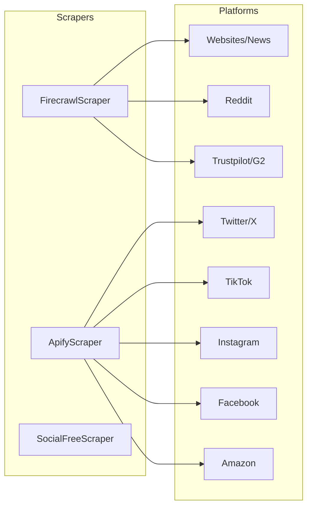

# Scrapers Module

> Documentation for data collection scrapers: Firecrawl, Apify, and SocialFree.

---

## Overview

The scraping layer provides unified data collection from 15+ platforms using a combination of web scraping (Firecrawl) and API-based collection (Apify).



---

## FirecrawlScraper

**File:** `backend/app/services/scrapers/firecrawl.py`
**Lines:** ~1,063
**API:** Firecrawl v1 (https://api.firecrawl.dev/v1)

### Rate Limiting

```python
_firecrawl_semaphore = asyncio.Semaphore(2)  # Max 2 concurrent
MIN_REQUEST_INTERVAL = 2.0  # seconds between requests
MAX_RETRIES = 3
RETRY_DELAY = 5.0  # seconds (exponential backoff)
```

### Initialization

```python
from app.services.scrapers.firecrawl import FirecrawlScraper

scraper = FirecrawlScraper()
if scraper.has_key:
    data = await scraper.search_reddit("brand review")
```

### Public Methods

| Method | Purpose | Returns |
|--------|---------|---------|
| `scrape_website(url)` | Scrape single URL to markdown | `str` |
| `map_website(url)` | Discover all URLs on site | `List[str]` |
| `search_brand(brand_name)` | Find brand website | `Dict` |
| `search_reddit(query)` | Search Reddit posts | `List[Dict]` |
| `scrape_subreddit(name)` | Scrape top monthly posts | `List[Dict]` |
| `search_forums(query)` | Search forum discussions | `List[Dict]` |
| `search_reviews(brand)` | Multi-site review search | `List[Dict]` |
| `scrape_trustpilot(brand)` | Trustpilot reviews | `List[Dict]` |
| `search_news_mentions(brand)` | News/blog articles | `List[Dict]` |
| `search_competitors(brand, sector)` | Competitor content | `List[Dict]` |
| `scrape_competitor_site(url)` | Scrape competitor page | `Dict` |
| `deep_search_segment(keywords, sector)` | Segment discussions | `List[Dict]` |
| `search_youtube_comments(brand)` | YouTube content | `List[Dict]` |
| `search_quora(query)` | Quora Q&A | `List[Dict]` |
| `search_medium_articles(brand)` | Medium posts | `List[Dict]` |
| `search_linkedin_posts(brand)` | LinkedIn content | `List[Dict]` |
| `search_product_hunt(brand)` | Product Hunt | `List[Dict]` |

### Error Handling

```python
async def _rate_limited_request(self, client, method, url, **kwargs):
    for attempt in range(self.MAX_RETRIES):
        try:
            async with _firecrawl_semaphore:
                # Enforce minimum interval
                await asyncio.sleep(self.MIN_REQUEST_INTERVAL)
                response = await client.request(method, url, **kwargs)
                if response.status_code == 429:
                    # Rate limited - exponential backoff
                    delay = self.RETRY_DELAY * (attempt + 1)
                    await asyncio.sleep(delay)
                    continue
                return response
        except Exception as e:
            if attempt == self.MAX_RETRIES - 1:
                raise
```

### Output Schema

```json
{
  "title": "Post title or headline",
  "content": "Full text content",
  "source_url": "https://...",
  "author": "username",
  "posted_at": "2025-12-15T10:30:00Z",
  "likes": 47,
  "comments_count": 12,
  "subreddit": "r/fitness"
}
```

---

## ApifyScraper

**File:** `backend/app/services/scrapers/apify.py`
**Lines:** ~993
**API:** Apify Cloud (https://apify.com)

### Actor Configuration

| Platform | Actor ID | Memory | Timeout |
|----------|----------|--------|---------|
| Twitter/X | `apidojo/tweet-scraper` | 4096 MB | 60s |
| TikTok | `clockworks/tiktok-scraper` | 4096 MB | 60s |
| Instagram | `apify/instagram-scraper` | 4096 MB | 60s |
| Facebook Ads | `apify/facebook-ads-scraper` | 4096 MB | 120s |
| Amazon | `junglee/amazon-reviews-scraper` | 4096 MB | 120s |
| Google Reviews | `compass/google-maps-reviews-scraper` | 4096 MB | 120s |

### Initialization

```python
from app.services.scrapers.apify import ApifyScraper

scraper = ApifyScraper()
if scraper.is_available:
    data = await scraper.scrape_tiktok(["#brandreview"], track=1)
```

### Public Methods

| Method | Purpose | Track | Returns |
|--------|---------|-------|---------|
| `scrape_twitter(queries, track)` | Search tweets | 1 or 2 | `List[Dict]` |
| `scrape_tiktok(queries, track)` | Search TikTok videos | 1 or 2 | `List[Dict]` |
| `scrape_instagram(queries, track)` | Search Instagram | 1 or 2 | `List[Dict]` |
| `scrape_instagram_profile(username, max)` | Brand profile | 1 | `List[Dict]` |
| `analyze_instagram_feed(posts)` | Feed statistics | - | `Dict` |
| `scrape_amazon_reviews(queries)` | Product reviews | 2 | `List[Dict]` |
| `scrape_google_reviews(queries)` | Business reviews | 2 | `List[Dict]` |
| `scrape_facebook_page(page_id)` | Page posts | 1 | `List[Dict]` |
| `scrape_facebook_ads(page_id, limit)` | Ad Library ads | 1 | `List[Dict]` |

### Graceful Degradation

```python
def is_available(self):
    """Returns True only if library installed AND API key present."""
    return self.client is not None and self.has_key

# All methods check availability first
async def scrape_twitter(self, queries, track=1):
    if not self.is_available:
        return []  # Graceful empty return
```

### Video URL Extraction

TikTok and Instagram responses include video URLs for Gemini analysis:

```json
{
  "id": "7123456789",
  "desc": "Video caption",
  "video_url": "https://...",
  "author": "@username",
  "stats": {
    "playCount": 50000,
    "diggCount": 2000,
    "commentCount": 150
  }
}
```

---

## SocialFreeScraper

**File:** `backend/app/services/scrapers/social_free.py`
**Status:** Legacy, mostly non-functional

### Methods (Deprecated)

| Method | Status |
|--------|--------|
| `scrape_nitter()` | ❌ Nitter dead |
| `scrape_instaloader()` | ⚠️ Requires login |
| `scrape_tiktok_api()` | ⚠️ Unreliable |
| `get_youtube_comments()` | ✅ Works |

> [!WARNING]
> This scraper exists for fallback but is unreliable. Use Apify for social media.

---

## Usage in Orchestrator

```python
# Example from research_orchestrator.py

async def _scrape_reddit(self, queries):
    results = []
    for query in queries.get("reddit", []):
        data = await self.firecrawl.search_reddit(query)
        results.extend(data)
    return results

async def _scrape_social(self, queries, track):
    results = []
    
    if self.apify.is_available:
        # Twitter
        twitter = await self.apify.scrape_twitter(
            queries.get("twitter", []), track
        )
        results.extend(twitter)
        
        # TikTok with video analysis
        tiktok = await self.apify.scrape_tiktok(
            queries.get("tiktok", []), track
        )
        analyzed = await self.social_analyzer.analyze_social_content(
            tiktok, platform="tiktok", max_videos=20
        )
        results.extend(analyzed)
    
    return results
```

---

## Common Errors

| Error | Cause | Resolution |
|-------|-------|------------|
| 429 Rate Limited | Too many requests | Auto-retry with backoff |
| Timeout | Slow response | Increase timeout, skip |
| No API Key | Missing env var | Set in `.env` |
| Actor Failed | Apify actor issue | Check actor status on Apify |
| Empty Results | No matching content | Normal - dataset may be empty |

---

## Configuration

```python
# config.py
MAX_POSTS_PER_SOURCE = 100  # Limit per scrape
SCRAPE_TIMEOUT = 20  # seconds

# Firecrawl
FIRECRAWL_API_KEY = "fc-xxx"
FIRECRAWL_BASE_URL = "https://api.firecrawl.dev/v1"

# Apify
APIFY_API_TOKEN = "apify_api_xxx"
```
