# AddIntelligence Pipeline (Insights Generation)

> The intelligence layer that transforms raw scraped data into actionable creative insights.

---

## Overview

**File:** `backend/app/services/insights.py`
**Lines:** ~480
**Purpose:** Generate Creative Dimensions (ICPs, pain points, messaging angles, etc.) from all scraped data.

---

## Pipeline Flow

```mermaid
flowchart LR
    subgraph Input
        T1[Track 1 Data]
        T2[Track 2 Data]
        AD[Ad Library Data]
        VID[Video Analyses]
    end
    
    subgraph Processing
        COUNT[Count by Source]
        FORMAT[Format for Prompt]
        PROMPT[Build LLM Prompt]
    end
    
    subgraph Generation
        LLM[OpenAI GPT-4o]
        PARSE[Parse JSON Response]
        VALIDATE[Validate Fields]
    end
    
    subgraph Output
        INS[Insights Object]
        REPORT[Full Report MD]
    end
    
    Input --> Processing --> Generation --> Output
```



---

## Class: InsightsGeneratorService

### Constructor

```python
def __init__(self):
    self.llm = get_llm_client()  # Uses configured provider (OpenAI)
```

### Main Method: `generate()`

```python
async def generate(
    self,
    brand_name: str,
    brand_info: Dict[str, Any],
    scraped_data: List[Dict[str, Any]]
) -> Dict[str, Any]:
```

**Parameters:**
- `brand_name`: Brand being analyzed
- `brand_info`: From brand_discovery (sector, vertical, products, audience)
- `scraped_data`: All ScrapedData records from session

**Returns:** Dictionary with 30+ insight fields

---

## LLM Configuration

| Setting | Value |
|---------|-------|
| Model | GPT-4o (via `LLM_PROVIDER` setting) |
| Temperature | 0.7 (creative but grounded) |
| Response Format | JSON |
| Timeout | 120 seconds |

---

## Prompt Structure

System prompt defined in `llm/prompts.py`:

```python
INSIGHTS_SYSTEM = """You are an expert brand strategist and consumer researcher.
Analyze the provided data and generate comprehensive insights..."""

INSIGHTS_GENERATION_PROMPT = """
Analyze the following data for {brand_name}:

BRAND CONTEXT:
- Sector: {sector}
- Vertical: {vertical}
- Products: {products}
- Target Audience: {target_audience}

TRACK 1 DATA (Brand Mentions):
{track1_data}

TRACK 2 DATA (Segment Research):
{track2_data}

Generate insights in the following JSON format:
{json_schema}
"""
```

---

## Output Schema

```json
{
  "brand_summary": "string - Overall brand perception",
  "sentiment_score": 0.65,
  "total_mentions": 347,
  
  "icps": [
    {
      "name": "Busy Professional Parent",
      "description": "Working parents who...",
      "demographics": "30-45, dual income",
      "pain_points": ["no time to cook"],
      "motivations": ["healthy family meals"],
      "objections": ["too expensive"]
    }
  ],
  
  "pain_points": [
    {"pain_point": "No time to cook", "frequency": "high", "source_count": 45}
  ],
  
  "value_props": [
    {"proposition": "Convenience", "resonance_score": 0.8}
  ],
  
  "messaging_angles": [
    {"angle": "Time savings", "target_icp": "Busy Professional", "hook_examples": [...]}
  ],
  
  "verbatim_quotes": [
    {"quote": "This saved my weeknights", "source": "reddit", "sentiment": "positive"}
  ],
  
  "recommended_hooks": [
    {"hook": "What if dinner was ready in 15 minutes?", "hook_type": "question"}
  ],
  
  "purchase_triggers": [...],
  "objections": [...],
  "competitor_analysis": {...},
  "top_positives": [...],
  "top_negatives": [...]
}
```

---

## Data Preparation

### `_format_data_for_prompt()`

Structures scraped data for LLM consumption:

```python
def _format_data_for_prompt(self, data, track_name):
    formatted = []
    for item in data[:100]:  # Limit to prevent token overflow
        formatted.append(f"""
Source: {item['source_type']}
Content: {item['content'][:500]}
Sentiment: {item.get('sentiment', 'unknown')}
---
""")
    return "\n".join(formatted)
```

### `_count_by_source()`

Generates statistics for context:

```python
# Returns: {"reddit": 45, "twitter": 23, "trustpilot": 15, ...}
```

---

## Validation

### `_validate_insights()`

Ensures all required fields exist with defaults:

```python
required_fields = [
    "brand_summary", "icps", "pain_points", "value_props",
    "messaging_angles", "verbatim_quotes", "recommended_hooks"
]

for field in required_fields:
    if field not in insights or not insights[field]:
        insights[field] = []  # Default to empty list
```

---

## Report Generation

### `_generate_markdown_report()`

Creates comprehensive markdown report (~300 lines template):

```markdown
# Brand Intelligence Report: {brand_name}

## Executive Summary
{brand_summary}

## Data Coverage
- Total mentions analyzed: {total}
- Sources: {sources_breakdown}

## Ideal Customer Profiles (ICPs)
{for each icp...}

## Pain Points Analysis
{pain_points_table}

## Messaging Recommendations
{messaging_angles}

## Verbatim Quotes (Ready for Ads)
{quotes}

## Competitive Landscape
{competitor_analysis}
```

---

## Error Handling

```python
try:
    response = await self.llm.generate_json(prompt, system)
    insights = self._validate_insights(response)
except Exception as e:
    logger.error(f"Insights generation failed: {e}")
    insights = self._get_empty_insights()  # Return safe defaults
```

---

## Dependencies

- `llm/client.py` - LLM client
- `llm/prompts.py` - Prompt templates
- Scraped data from all sources
- Brand discovery info

---

## Cost Tracking

Each insights generation uses approximately:
- Input: 10,000-50,000 tokens (depending on data volume)
- Output: 2,000-5,000 tokens
- Estimated cost: $0.10-0.50 per run
