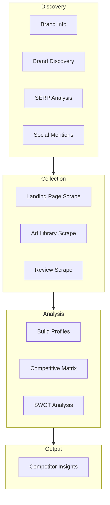

# Competitor Analysis Pipeline

> Competitive intelligence gathering and analysis system.

---

## Overview

**File:** `backend/app/services/competitors/analyzer.py`
**Lines:** ~400
**Purpose:** Identify, analyze, and compare competitors to inform strategy.

---

## Pipeline Flow



---

## Competitor Detection

### Sources of Competitor Names

1. **Brand Discovery** - LLM extracts from website content
2. **SERP Analysis** - "brand vs" and "brand alternatives" searches
3. **Social Mentions** - Competitors mentioned in brand discussions
4. **Ad Library** - Similar advertisers in same category

### Detection Logic

```python
# From brand_discovery.py
competitors_mentioned = extract_competitors_from_content(website_content)

# From SERP
await firecrawl.search_competitors(brand_name, sector)
# Searches: "{brand} vs", "{brand} alternatives", "best {vertical}"
```

---

## Data Collection per Competitor

### Landing Page Analysis

```python
async def analyze_landing_page(url):
    content = await firecrawl.scrape_website(url)
    analysis = await llm.analyze(content)
    return {
        "value_propositions": [...],
        "pricing_info": {...},
        "target_audience": "...",
        "ctas": [...],
        "testimonials": [...]
    }
```

### Ad Library Scraping

```python
# Scrape competitor ads (limited to 5 per competitor)
competitor_ads = await adlib_scraper.scrape_competitor_ads(
    competitor_page_id,
    limit=5
)
```

### Review Collection

```python
# Trustpilot, G2, etc.
reviews = await firecrawl.scrape_trustpilot(competitor_name)
```

---

## Competitor Profile Schema

```json
{
  "name": "HelloFresh",
  "website": "https://www.hellofresh.com",
  "sector": "Meal Kit Delivery",
  
  "positioning": {
    "tagline": "Get cooking. Get ready to fall in love with cooking!",
    "value_props": ["Variety", "Convenience", "Family-friendly"],
    "target_audience": "Busy families"
  },
  
  "pricing": {
    "entry_price": "$7.49/serving",
    "plans": ["2 people", "4 people"],
    "promotions": "50% off first box"
  },
  
  "strengths": [
    "Large recipe variety",
    "Strong brand recognition"
  ],
  
  "weaknesses": [
    "Higher price point",
    "Plastic packaging concerns"
  ],
  
  "ad_intelligence": {
    "common_hooks": ["Don't know what to cook?"],
    "dominant_style": "professional",
    "cta_patterns": ["Get started"]
  },
  
  "sentiment_score": 0.62,
  "review_count": 45000
}
```

---

## Competitive Matrix

Comparison table generated for insights:

```json
{
  "dimensions": ["price", "variety", "convenience", "quality", "sustainability"],
  "competitors": [
    {
      "name": "GoodFood",
      "scores": {"price": 4, "variety": 3, "convenience": 5, "quality": 4, "sustainability": 3}
    },
    {
      "name": "HelloFresh",
      "scores": {"price": 3, "variety": 5, "convenience": 4, "quality": 4, "sustainability": 2}
    }
  ]
}
```

---

## SWOT Analysis

Generated for target brand based on competitive landscape:

```json
{
  "strengths": [
    "Local focus (Canada)",
    "Competitive pricing",
    "Easy prep options"
  ],
  "weaknesses": [
    "Smaller recipe variety than HelloFresh",
    "Limited brand awareness"
  ],
  "opportunities": [
    "Sustainability messaging",
    "Premium tier introduction"
  ],
  "threats": [
    "Market consolidation",
    "Rising ingredient costs"
  ]
}
```

---

## Output Fields in Insights

| Field | Type | Description |
|-------|------|-------------|
| `competitor_profiles` | `List[Dict]` | Full profile per competitor |
| `competitive_matrix` | `Dict` | Comparison scoring |
| `swot_analysis` | `Dict` | SWOT for brand |
| `competitor_ads_data` | `Dict` | Ad patterns from competitors |
| `competitors_mentioned` | `List[str]` | Competitors found in data |

---

## Usage in Orchestrator

```python
# Phase 5: Competitor Analysis
if competitors:
    for comp in competitors[:3]:  # Limit to top 3
        profile = await self.competitor_analyzer.build_profile(comp)
        competitor_profiles.append(profile)
    
    matrix = await self.competitor_analyzer.build_matrix(
        brand_name, competitor_profiles
    )
    
    swot = await self.competitor_analyzer.generate_swot(
        brand_info, competitor_profiles
    )
```

---

## Rate Limiting

Competitor analysis is rate-limited to prevent API overuse:
- Max 3 competitors analyzed deeply
- 5 ads scraped per competitor
- Staggered requests with 2-second delays
