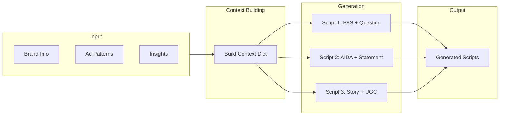

# Script Generation Pipeline

> AI-powered ad script generation using brand insights and creative patterns.

---

## Overview

**File:** `backend/app/services/generators/scripts.py`
**Lines:** ~353
**Purpose:** Generate professional ad scripts informed by real customer language and proven patterns.

---

## Pipeline Flow



---

## Class: ScriptGenerator

### Constructor

```python
def __init__(self):
    # Uses Gemini specifically for scripts (handles long prompts better)
    self.llm = get_llm_client(provider="gemini")
```

### Main Method: `generate_scripts()`

```python
async def generate_scripts(
    self,
    brand_info: Dict[str, Any],
    ad_patterns: Dict[str, Any],
    insights: Dict[str, Any],
    num_scripts: int = 3
) -> List[Dict]:
```

**Strategy:** Generates scripts ONE AT A TIME for reliability (not parallel)

---

## Input Requirements

### Brand Info
```json
{
  "name": "GoodFood",
  "sector": "Meal Kit Delivery",
  "products": ["Meal Kits", "Easy Prep"],
  "brand_values": ["Quality", "Convenience"],
  "tone_of_voice": ["Friendly", "Approachable"]
}
```

### Ad Patterns (from Ad Library analysis)
```json
{
  "common_hooks": ["Did you know...", "Stop scrolling if..."],
  "dominant_frameworks": ["PAS", "AIDA"],
  "avg_duration_seconds": 28,
  "style_breakdown": {"ugc": 60, "professional": 40},
  "cta_patterns": ["Shop now", "Try risk-free"]
}
```

### Insights
```json
{
  "icps": [...],
  "pain_points": [...],
  "verbatim_quotes": [...],
  "messaging_angles": [...],
  "objections": [...]
}
```

---

## Framework + Hook Combinations

Scripts are generated using different framework/hook combinations:

| Script | Framework | Hook Type |
|--------|-----------|-----------|
| 1 | PAS (Problem-Agitate-Solution) | Question |
| 2 | AIDA (Attention-Interest-Desire-Action) | Statement |
| 3 | Story | UGC-style |

---

## Context Building

### `_build_context()`

Organizes all inputs into structured context:

```python
context = {
    "brand": {
        "name": brand_info["name"],
        "sector": brand_info.get("sector"),
        "tone": brand_info.get("tone_of_voice", []),
        "values": brand_info.get("brand_values", [])
    },
    "customer": {
        "pain_points": [...],
        "objections": [...],
        "quotes": [...],  # Verbatim customer language
        "icps": [...]
    },
    "creative": {
        "proven_hooks": [...],
        "frameworks_used": [...],
        "avg_duration": 28
    }
}
```

---

## Script Generation

### `_generate_single_script()`

Generates one script with 90-second timeout:

```python
async def _generate_single_script(
    self,
    context: Dict,
    framework: str,  # "PAS", "AIDA", "Story"
    hook_type: str,  # "question", "statement", "ugc"
    script_num: int
) -> Dict:
```

---

## Output Schema

```json
{
  "title": "The 6PM Panic",
  "hook": "It's 6PM. The kids are hungry. You have nothing planned.",
  "hook_type": "pain_point",
  "framework": "PAS",
  "duration_seconds": 30,
  "platform": "tiktok",
  "style": "ugc",
  
  "scene_breakdown": [
    {
      "scene_number": 1,
      "time_range": "0:00-0:03",
      "visual": "Close-up of clock showing 6:00 PM",
      "audio": "Oh no, it's already 6...",
      "text_overlay": null
    },
    {
      "scene_number": 2,
      "time_range": "0:03-0:10",
      "visual": "Empty fridge shot",
      "audio": "And I have literally nothing...",
      "text_overlay": "We've all been there"
    }
  ],
  
  "full_script": "The complete script as one text block",
  
  "target_icp": "Busy Professional Parent",
  "pain_point_addressed": "No time to cook",
  "cta": "Get 50% off your first box with code EASY"
}
```

---

## Prompt Template

```python
SCRIPT_SYSTEM = """You are a world-class direct response copywriter...
- Create scripts that feel authentic, not salesy
- Use the customer's exact words to describe their problem
- Address objections naturally within the narrative
- Have a clear, compelling CTA

ALWAYS return valid JSON only. No markdown, no explanation."""
```

---

## Fallback Handling

### `_create_fallback_script()`

Creates professional fallback when LLM fails:

```python
def _create_fallback_script(self, brand_name, framework, num):
    return {
        "title": f"{brand_name} Ad Script {num}",
        "hook": f"Discover how {brand_name} can help you",
        "framework": framework,
        "scene_breakdown": [
            {"scene_number": 1, "visual": "Brand intro", "audio": "..."}
        ],
        "full_script": "...",
        "style": "professional"
    }
```

---

## Additional Methods

### `generate_variations()`
Generate variations of an existing script (different hooks).

### `adapt_script_for_platform()`
Adapt script for different platforms (TikTok, Instagram, YouTube).

---

## LLM Configuration

| Setting | Value |
|---------|-------|
| Model | Gemini 2.0 Flash |
| Temperature | 0.8 (creative) |
| Timeout | 90 seconds per script |
| Retries | 3 per script |

---

## Error Handling

```python
try:
    script = await asyncio.wait_for(
        self._generate_single_script(context, framework, hook_type, i),
        timeout=90
    )
    if script:
        scripts.append(script)
except asyncio.TimeoutError:
    logger.warning(f"Script {i} generation timed out")
    scripts.append(self._create_fallback_script(...))
except Exception as e:
    logger.error(f"Script {i} generation failed: {e}")
    scripts.append(self._create_fallback_script(...))
```
