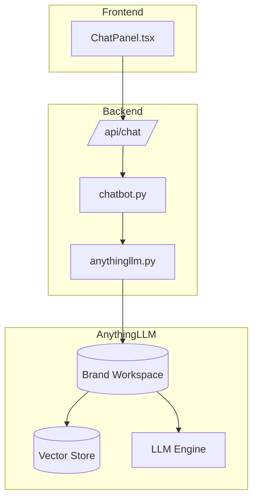

# RAG + Chat Integration

> RAG (Retrieval Augmented Generation) system with AnythingLLM integration for brand-aware chat.

---

## Overview

The RAG system provides context-aware chat capabilities by:
1. Indexing all research data per brand
2. Retrieving relevant context for queries
3. Generating grounded responses with citations

---

## Architecture



---

## Indexing Pipeline

### What Gets Indexed

| Content Type | Source | Notes |
|--------------|--------|-------|
| Scraped content | `scraped_data` | Title + content |
| Video transcriptions | Video analysis | Full verbatim |
| Insights | `insights` table | ICPs, pain points |
| Generated scripts | Script generator | For reference |
| Full report | Report generator | Comprehensive summary |

### Export to Knowledge Base

**File:** `services/kb_exporter.py`

```python
async def export_session(session_id: int, brand_name: str):
    """Export session data to knowledge_base/{brand}/"""
    
    # Create brand folder
    brand_dir = f"knowledge_base/{brand_name}"
    
    # Export scraped data
    export_scraped_data(session_id, brand_dir)
    
    # Export insights
    export_insights(session_id, brand_dir)
    
    # Export scripts
    export_scripts(session_id, brand_dir)
    
    return brand_dir
```

### Output Structure

```
knowledge_base/
├── goodfood/
│   ├── scraped_reddit.md
│   ├── scraped_trustpilot.md
│   ├── scraped_tiktok.md
│   ├── video_analyses.md
│   ├── insights.md
│   ├── scripts.md
│   └── full_report.md
```

---

## AnythingLLM Integration

**File:** `services/anythingllm.py`

### Workspace Management

```python
async def create_workspace(brand_name: str):
    """Create AnythingLLM workspace for brand."""
    response = await client.post(
        f"{ANYTHINGLLM_URL}/api/v1/workspace/new",
        json={"name": f"brand-{brand_name}"}
    )
    return response.json()["workspace"]
```

### Document Upload

```python
async def upload_documents(workspace_slug: str, files: List[str]):
    """Upload documents to workspace for embedding."""
    for file_path in files:
        await client.post(
            f"{ANYTHINGLLM_URL}/api/v1/workspace/{workspace_slug}/upload",
            files={"file": open(file_path)}
        )
```

### Sync Brand Data

```python
async def sync_brand_to_workspace(session_id: int, brand_name: str):
    """Full sync: export, upload, embed."""
    
    # 1. Export to knowledge base
    kb_path = await kb_exporter.export_session(session_id, brand_name)
    
    # 2. Create/get workspace
    workspace = await get_or_create_workspace(brand_name)
    
    # 3. Upload documents
    files = list(Path(kb_path).glob("*.md"))
    await upload_documents(workspace["slug"], files)
    
    # 4. Trigger embedding
    await embed_documents(workspace["slug"])
```

---

## Chat Flow

### API Endpoint

**File:** `routers/chat.py`

```python
@router.post("/")
async def chat(
    message: str,
    session_id: int,
    db: AsyncSession = Depends(get_db)
):
    """Chat with brand context."""
    
    # Get brand from session
    session = await get_session(session_id, db)
    brand_name = session.brand.name
    
    # Get workspace
    workspace_slug = f"brand-{slugify(brand_name)}"
    
    # Query AnythingLLM
    response = await anythingllm_query(workspace_slug, message)
    
    return {
        "response": response["textResponse"],
        "sources": response["sources"]
    }
```

### AnythingLLM Query

```python
async def query_workspace(workspace_slug: str, message: str):
    """Query workspace with RAG."""
    response = await client.post(
        f"{ANYTHINGLLM_URL}/api/v1/workspace/{workspace_slug}/chat",
        json={
            "message": message,
            "mode": "query"  # Uses RAG
        }
    )
    return response.json()
```

---

## Retrieval Configuration

### Vector Store

| Setting | Value |
|---------|-------|
| Engine | ChromaDB (via AnythingLLM) |
| Embedding Model | Default (AnythingLLM managed) |
| Chunk Size | 1000 characters |
| Chunk Overlap | 100 characters |

### Query Settings

| Setting | Value |
|---------|-------|
| Top-K | 4 documents |
| Score Threshold | 0.7 |
| Mode | Query (with RAG) |

---

## Response Format

```json
{
  "textResponse": "Based on the research data, GoodFood customers primarily value...",
  "sources": [
    {
      "title": "scraped_reddit.md",
      "chunk": "User mentioned that GoodFood's portions are...",
      "score": 0.89
    }
  ],
  "close": false
}
```

---

## Hallucination Prevention

### System Prompt

```python
CHAT_SYSTEM = """You are a brand research assistant. 
Answer based ONLY on the provided context documents.

RULES:
- If the context doesn't contain relevant information, say so
- Quote directly from sources when possible
- Never fabricate statistics or quotes
- Cite which document the information came from
"""
```

### No Evidence Response

```python
if not response["sources"]:
    return {
        "response": "I don't have specific information about this in the research data. The available data covers: [list topics]",
        "sources": []
    }
```

---

## Frontend Integration

**File:** `frontend/src/components/ChatPanel.tsx`

```typescript
const sendMessage = async (message: string) => {
  setLoading(true);
  
  const response = await api.post('/api/chat/', {
    message,
    session_id: sessionId
  });
  
  setMessages([...messages, {
    role: 'assistant',
    content: response.data.response,
    sources: response.data.sources
  }]);
  
  setLoading(false);
};
```

### UX States

| State | Display |
|-------|---------|
| Loading | "Searching research data..." |
| Success with sources | Response + source citations |
| No evidence | "No specific data found" message |
| Error | Fallback to simple chat mode |

---

## Configuration

```env
# AnythingLLM connection
ANYTHINGLLM_API_KEY=xxx-xxxxxx-xxxxxxx-xxxxxx
ANYTHINGLLM_URL=http://localhost:3001  # Docker service
```

---

## Error Handling

```python
try:
    response = await query_workspace(workspace, message)
except httpx.ConnectError:
    # AnythingLLM not running
    return await fallback_simple_chat(message)
except Exception as e:
    logger.error(f"Chat error: {e}")
    return {"response": "Unable to process query", "sources": []}
```
